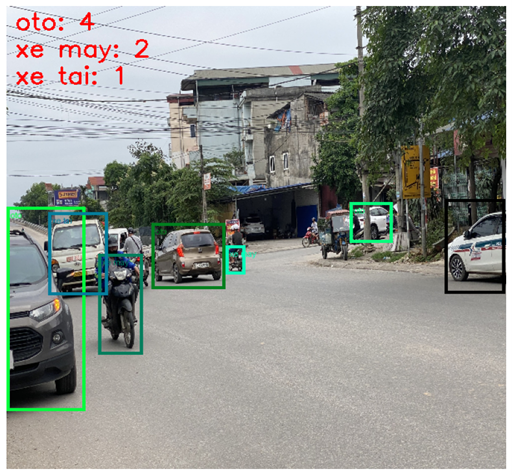

# 🚗 Phát Hiện Phương Tiện Giao Thông

Nhận diện và phân loại phương tiện theo thời gian thực với **Faster R-CNN ResNet-50 FPN**.


---

## 📸 Demo

<!-- Thêm ảnh predict mẫu sau khi có kết quả -->


---

## Tính năng

- Phát hiện nhiều loại phương tiện cùng lúc — xe máy, ô tô, xe tải, xe buýt…
- Vẽ bounding box kèm nhãn và độ tin cậy trên từng đối tượng
- Thống kê số lượng từng loại phương tiện theo frame
- Hỗ trợ nhận diện ảnh tĩnh và video
- Giao diện desktop Tkinter
- Tự động dùng GPU (CUDA), fallback về CPU nếu không có

---

## Cài đặt

```bash
git clone https://github.com/Namvipcf/vehicle-detection.git
cd vehicle-detection
pip install -r requirements.txt
```

> **GPU:** Truy cập [pytorch.org](https://pytorch.org/get-started/locally/) để cài đúng phiên bản CUDA.

---

## Sử dụng

**Chạy giao diện**

```bash
python GiaoDien.py
```

**Nhận diện ảnh**

```bash
python test.py --image path/to/image.jpg
```

**Nhận diện video**

```bash
python test.py --video path/to/video.mp4
```

**Huấn luyện từ đầu**

```bash
python train.py
```

---

## Cấu trúc thư mục

```
vehicle-detection/
├── train.py              # Huấn luyện mô hình
├── test.py               # Đánh giá & nhận diện ảnh/video
├── GiaoDien.py           # Giao diện Tkinter
├── requirements.txt
├── LICENSE
├── README.md
│
│
├── Dataset/              # Không push 
│   ├── train/
│   │   ├── *.jpg
│   │   └── _annotations.coco.json
│   ├── valid/
│   │   └── _annotations.coco.json
│   └── test/
│       └── _annotations.coco.json
│
├── model_vehicle.pth     # Không push 
└── outputs/              # Video/ảnh kết quả
```

---

## Dataset

Nguồn: [Roboflow Universe — vehicle detection](https://universe.roboflow.com/deeplearning-fcpdy/vehicle-detection-dxq3o)  
License: [CC BY 4.0](https://creativecommons.org/licenses/by/4.0/)

| Thông tin | Chi tiết |
|-----------|----------|
| Tổng số ảnh | 2.172 |
| Số lớp | 5 |
| Định dạng | COCO JSON |
| Task | Object Detection |

**Các lớp:**

| Nhãn | Phương tiện |
|------|-------------|
| `oto` | Ô tô |
| `xe may` | Xe máy |
| `xe bus` | Xe buýt |
| `xe tai` | Xe tải |
| `xe dap` | Xe đạp |

Dataset được thu thập và gán nhãn thủ công trên [Roboflow](https://roboflow.com).

**Trích dẫn:**

```bibtex
@misc{ vehicle-detection-dxq3o_dataset,
  title  = { vehicle detection Dataset },
  author = { Deeplearning },
  url    = { https://universe.roboflow.com/deeplearning-fcpdy/vehicle-detection-dxq3o },
  publisher = { Roboflow },
  year   = { 2025 },
}
```

---

## Kết quả

| Chỉ số | Score |
|--------|-------|
| mAP@50-95 (IoU=0.5:0.95) | 0.554 |
| mAP@50 (IoU=0.5) | 0.866 |
| Precision | 0.909 |
| Recall | 0.821 |

---

## Cấu hình

| Tham số | Giá trị |
|---------|---------|
| Backbone | ResNet-50 + FPN |
| Input | 600 × 600 |
| Optimizer | SGD lr=0.01, momentum=0.9 |
| Epochs | 10 |
| Batch size | 8 |
| Score threshold | 0.5 |

---

## License

MIT License — xem [LICENSE](LICENSE)

---

## Tác giả

**Nguyễn Văn Bắc**
- GitHub: (https://github.com/Namvipcf)
- Kaggle: (https://www.kaggle.com/bacnguyen2003)
